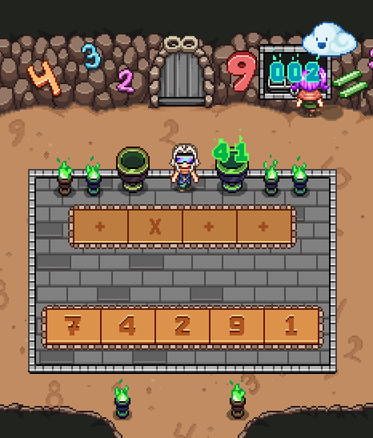

# [《Secrets of Grindea》](https://store.steampowered.com/app/269770/) 数字谜题解答器

[网页应用](https://natescarlet.github.io/grindea-math-puzzle/)

给出多个运算符和数字，求能得到指定结果并且所有元素刚好使用一次的数学表达式。

运算符: `+` `-` `*`

数字: 1-9
